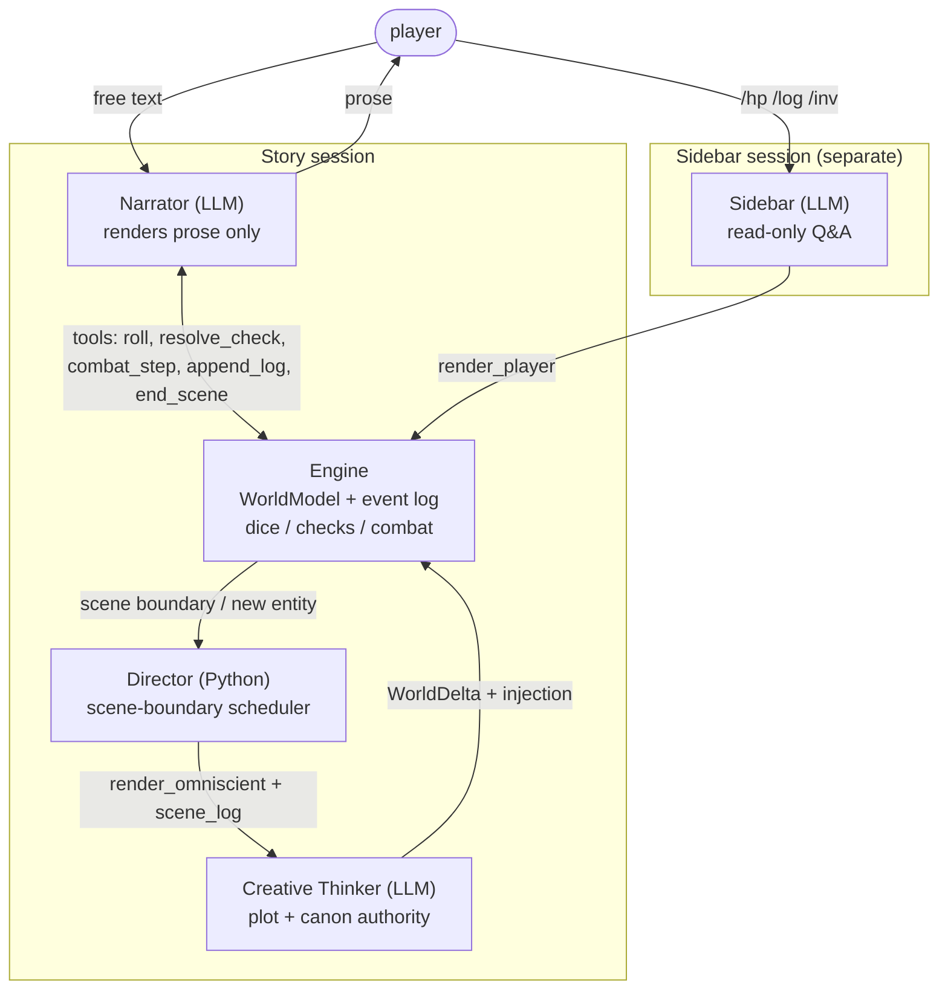

# AutoDND — LLM Dungeon Master, MVP Plan

## Context

Build a one-shot D&D Dungeon Master that prioritizes interactive storytelling over rules fidelity.

- **LLM as yes-man.** Bare LLMs follow the player's framing — no real twists, foreshadowing, or pushback.
- **Context flooding.** Mechanical queries (HP, dice math) in the same conversation as narrative pollute it.

The architectural goal: a deterministic program wrapped around a creative oracle, with **structural** defenses against drift. Repo is a stub (Python 3.14, no deps) — greenfield.

## Architecture



1. **Engine** — single source of truth. Owns `WorldModel`, `render_omniscient`/`render_player`, and `apply_world_delta` (with append-only validation). Implements dice/checks/combat as deterministic Python.
2. **Narrator** — renders one turn as prose. Sees only `render_player(world)` + transient scene log + any pending Creative Thinker injection. Cannot decide outcomes; cannot mutate canon.
3. **Director** — Python scheduler with no LLM persona. At each scene boundary, dispatches the Creative Thinker with the omniscient render and the scene log. Also dispatches on-demand for new entities.
4. **Creative Thinker** — the plot brain. Given `render_omniscient(world)` + scene log, returns a `WorldDelta` (events, knowledge, thread updates, optional new entities, optional Narrator injection). Pacing is the LLM's call, not a counter.
5. **Sidebar** — separate session for `/hp`, `/log`, `/inv`. Never feeds into Narrator context.

## World Model

Three layers. Layer 1 is atomic facts. Layer 2 organizes them. Layer 3 is the player's perspective on them. Storage is a normalized graph (entities indexed by id, refs cross-cut). Tree shape lives in the **rendering** layer (see below) — Pydantic doesn't have to mirror it.

### Layer 1 — atoms

- **Location**: id, name, description (NL, full truth).
- **Item**: id, name, description (NL — covers equipment, lore items, *and* skills).
- **Event**: id, monotonic fictional time `t`, location_id, participants (character ids), description (NL — full truth of what happened), thread_id (home thread). Public events get pointed at by knowledge entries; private events (motives, off-screen actions) just exist.

### Layer 2 — organization

- **Character** (NPC only): id, name, description (NL, full truth — omniscient), location_id (current), stats (HP/AC/modifiers). Player is *not* a Character.
- **Thread**: id, name, parent_id (Optional — threads form a forest), description (NL, arc/synopsis). A thread "owns" events via `event.thread_id`.

### Layer 3 — perspective

- **KnowledgeEntry**: event_id (**Optional** — `None` for pure assumptions), text (NL — player's view; may be partial, wrong, a tell, or pure assumption), learned_at (turn-time, for chronology).
- **PlayerState**: location_id, stats, items, knowledge (`list[KnowledgeEntry]`, append-only).

### Schemas

```python
class Item(BaseModel):
    id: str; name: str
    description: str

class Location(BaseModel):
    id: str; name: str
    description: str            # NL — full truth (omniscient)

class Event(BaseModel):
    id: str
    t: int                      # ascending fictional timestamp
    location_id: str
    participants: list[str]     # character ids
    description: str            # NL — full truth of what happened
    thread_id: str              # home thread

class Character(BaseModel):     # NPC
    id: str; name: str
    description: str            # NL — full truth (omniscient)
    location_id: str            # current
    stats: CharacterStats

class Thread(BaseModel):
    id: str; name: str
    parent_id: Optional[str]    # nested → forest
    description: str            # NL — arc / synopsis (updateable)

class KnowledgeEntry(BaseModel):
    event_id: Optional[str]     # None = pure assumption
    text: str                   # NL — player's view
    learned_at: int

class PlayerState(BaseModel):
    location_id: str
    stats: CharacterStats
    items: list[str]
    knowledge: list[KnowledgeEntry]   # append-only

class WorldModel(BaseModel):
    locations: dict[str, Location]
    items: dict[str, Item]
    characters: dict[str, Character]
    events: dict[str, Event]
    threads: dict[str, Thread]
    player: PlayerState
    turn: int                   # narrator-turn counter
    fictional_time: int         # monotonic source for next Event.t
```

### Why this shape

1. **Events are atoms.** Anything dramatically interesting is an event. No surface/secret duplication on entities — each entity has one `description` (the truth, omniscient). The player's picture of an entity is built up from knowledge entries that ref events involving it.
2. **False knowledge is first-class.** `KnowledgeEntry.event_id` is `Optional`. Three flavors fall out naturally:
   - *Pure assumption*: `event_id=None`, NL text. ("I assume the kingdom is at peace.")
   - *Misinterpretation*: `event_id` set, NL text disagrees with the canonical event description. ("Hadrian seemed embarrassed by the gold" — actual event: he was sizing up the pouch.)
   - *Tell*: `event_id` points to a private event with no other knowledge entries; NL text is oblique. ("Something felt off about the way he turned away" — points to "Hadrian decided to betray.")
3. **Supersession is just chronology.** If the player learns the truth, append a newer entry; the older false belief stays in the timeline. Latest-on-subject wins for present-tense rendering.
4. **Append-only canon at the entity level.** `Location.description`, `Character.description`, `Item.description`, and any individual `Event` are write-once. `Thread.description` can be updated (synopsis evolves); events list grows; player.knowledge grows.

### Rendering — the tree projection

LLMs read trees better than graphs. Storage is normalized (refs by id, threads form a forest, characters cross-cut events). Two renderer functions flatten the graph into tree-shaped markdown — one per call site:

- **`render_omniscient(world) -> str`** (for Creative Thinker): walk the thread forest top-down. Each thread shows its description, its events chronologically (location and participants resolved by name inline), then nested children. Sidebars: characters (with current location), locations encyclopedia, items. Player state at the bottom.
- **`render_player(world) -> str`** (for Narrator): a chronological knowledge timeline, each entry with `(t=N) text` and any references resolved by name only if the player has been told. Plus: current location (description if the player has visited), characters present (resolved by name only if known), inventory.

Pydantic stays normalized; trees only appear in rendered text.

**Items subsume skills.** A persuasion skill is an `Item` with `description: "trained ability: +5 to social checks"`. One concept, one schema.

## Flow

Two cadences: per-turn (mid-scene, deterministic) and scene-boundary (canon mint, plot pacing).

### Per turn (player input → prose)

1. Player text in.
2. If slash-command → Sidebar; return.
3. Otherwise Narrator turn. Prompt = `render_player(world)` + transient `scene_log` + any pending Creative Thinker injection.
4. Narrator may call `roll` / `resolve_check` / `combat_step`; engine produces a `Resolution`.
5. Narrator narrates. Engine appends prose to `scene_log: list[LogEntry]`.

The scene log is **transient, not canon**. It accumulates within a scene and is consumed (and cleared) when the scene boundary fires. Per-turn, no events are minted, no knowledge is appended, no thread is advanced. Plot stays still mid-scene.

### Scene boundaries

A scene boundary is a structural break — a location change, a combat ending, a conversation resolving, a planned rest, a time skip. That's when canon events get minted and the plot may advance.

Triggers, in order of precedence:

1. **Engine-detected (deterministic)** — `player.location_id` changed, combat just ended (last hostile down or PC fled), or a `rest` / `time_skip` tool was called.
2. **Narrator-emitted** — `end_scene(reason)` tool call when the dramatic beat has resolved (NPC walks off, party finishes a meal, door closes). Structural, not narrative — "this unit is done," not an outcome decision.
3. **On-demand** — a new entity referenced in player input that doesn't exist in canon triggers a Creative Thinker call to mint it. Uses the same pathway, but only the entity-creation slice of the delta runs.

When a boundary fires:

1. Director sends `render_omniscient(world) + scene_log` to Creative Thinker.
2. Creative Thinker returns a `WorldDelta`:

```python
class WorldDelta(BaseModel):
    events_to_mint: list[Event]            # condense scene_log + author private events
    knowledge_to_append: list[KnowledgeEntry]   # player view of public events; tells; assumptions
    threads_to_update: dict[str, str]      # thread_id → new description
    threads_to_create: list[Thread]
    entities_to_create: list[Location | Character | Item]   # for on-demand minting
    narrator_injection: Optional[str]      # text the next Narrator turn must incorporate
```

3. Engine validates and applies. **Validation rejects:** rewriting any existing `Event`, rewriting any existing `Location`/`Character`/`Item.description`. **Validation accepts:** new entities, new events, knowledge appends, thread description updates, new threads.
4. Scene log is cleared.
5. Injection (if any) is queued for the next Narrator prompt.

If none of (1)/(2)/(3) fires, scene continues; Director sits out.

### Bootstrap

One Creative Thinker call at game start authors most canon: locations, characters, items, threads, plus a handful of seed events (the backstory) and the initial knowledge entries the player needs to make sense of "now" (e.g. "you are a courier carrying a letter to Sken").

## Worked example

### Bootstrap (Creative Thinker authors at t=0)

- **Locations**: `inn` — "Crow's Foot Inn, roadside, dusk; smoky common room, four trestle tables, stewpot over coals; the candle-on-the-outer-windowsill is the local bandit-crew's signal."
- **Items**: `gold_pouch`, `shortsword`, `persuasion_skill` ("trained ability: +2 to social checks").
- **Characters**: `hadrian` @ `inn` — "Ruddy innkeeper in his fifties, talkative, generous with stew. Informant for the road's bandit crew; sizes up travellers and signals an ambush if any are worth robbing."
- **Threads**: `inn_night` (no parent) — "PC stops at Crow's Foot for the night. If PC reveals wealth, Hadrian tips off the bandits; ambush at dawn on the north road. If unobtrusive, Hadrian lets them pass."
- **Events** (seed, t=1): `e_arrival` at `inn`, participants=`[hadrian]`, "PC arrived at Crow's Foot at dusk; Hadrian welcomed them.", thread=`inn_night`.
- **Player**: location=`inn`, items=`[gold_pouch, shortsword, persuasion_skill]`, knowledge=`[KE(event_id=e_arrival, text="You arrived at the Crow's Foot Inn at dusk; the innkeeper, Hadrian, welcomed you in.", learned_at=0)]`.

`fictional_time = 1`. Scene log is empty.

### Turn 1 — "I order a meal and ask Hadrian about the road north."

1. Narrator turn. Prompt = `render_player(world)` + empty scene log.
2. Narrator calls `resolve_check(skill="persuasion", dc=10)`. Engine rolls `14+2=16` → `Resolution(outcome="success")`.
3. Narrator narrates: *"Hadrian wipes his hands on his apron. 'North? Quiet road this week. Caravans took the southern fork.' He ladles an extra spoon of stew without asking."*
4. Engine appends to scene log: *"PC asked about the north road over stew; persuasion success; Hadrian shared freely."*
5. No `end_scene`. Director sits out.

**State change:** scene log grew by one entry. Canon, knowledge, fictional_time unchanged.

### Turn 2 — "I pay him with a gold coin from my pouch."

1. Narrator narrates: *"You produce a gold coin. Hadrian's eyes flick to the pouch — just a beat — before he pockets the coin with a grateful nod."*
2. Engine appends to scene log: *"PC paid with a gold coin from a visibly fat pouch; Hadrian noted the pouch."*
3. Narrator calls `end_scene("PC retiring upstairs for the night.")`.
4. Director ticks. Sends `render_omniscient(world)` + scene log to Creative Thinker.
5. Creative Thinker reads thread `inn_night`, Hadrian's full description, and the scene log. Wealth-reveal trips. Returns a `WorldDelta`:

```json
{
  "events_to_mint": [
    { "id": "e_inn_meal",        "t": 2, "location_id": "inn", "participants": ["hadrian"],
      "description": "PC ate stew, asked about the north road; Hadrian volunteered information freely while sizing them up.",
      "thread_id": "inn_night" },

    { "id": "e_inn_payment",     "t": 3, "location_id": "inn", "participants": ["hadrian"],
      "description": "PC paid Hadrian with a gold coin from a visibly fat pouch. Hadrian noted the pouch.",
      "thread_id": "inn_night" },

    { "id": "e_hadrian_decides", "t": 4, "location_id": "inn", "participants": ["hadrian"],
      "description": "Hadrian privately decided to signal the bandit crew tonight — PC has gold worth ambushing for at dawn on the north road.",
      "thread_id": "inn_night" },

    { "id": "e_hadrian_signals", "t": 5, "location_id": "inn", "participants": ["hadrian"],
      "description": "Hadrian set a single tallow candle on the outer windowsill — the bandit-crew's signal.",
      "thread_id": "inn_night" }
  ],
  "knowledge_to_append": [
    { "event_id": "e_inn_meal",    "text": "You ate stew. Hadrian was friendly and helpful about the road north.",
      "learned_at": 1 },
    { "event_id": "e_inn_payment", "text": "You paid with a gold coin; Hadrian's eyes lingered on your pouch a moment too long.",
      "learned_at": 2 }
  ],
  "threads_to_update": {
    "inn_night": "Hadrian has chosen to betray the PC. Bandit ambush scheduled for dawn on the north road; signal candle has been set."
  },
  "threads_to_create": [],
  "entities_to_create": [],
  "narrator_injection": "As you climb the stairs, you glimpse Hadrian through the landing window placing a single tallow candle on the outer sill — flame steady against the cool wind. An odd hour for it."
}
```

6. Engine validates and applies: 4 events committed (`e_hadrian_decides` and `e_hadrian_signals` are **private** — no knowledge points at them). 2 knowledge entries appended. Thread description updated. Hadrian's `description` **not** rewritten. Scene log cleared. Injection queued. `fictional_time` advances to 5.

**State change:** events table has 5 entries (1 seed + 4 minted). `player.knowledge` has 3 entries. Two events have no knowledge pointer — they're private canon.

### Turn 3 — "I head upstairs."

1. Narrator turn. Prompt = `render_player(world)` (which now includes the 2 new knowledge entries) + queued injection + empty scene log.
2. Narrator narrates: *"You climb the creaking stairs, the gold-pouch glance still bothering you. At the landing you glance through the small window — on the sill below, a single tallow candle burns steady against the wind. Strange thing for an innkeeper to leave out."*
3. Engine appends to scene log: *"PC climbed the stairs; saw the candle on the outer sill."*
4. No `end_scene`. Scene continues.

The candle was committed as canon `e_hadrian_signals` at the previous boundary, but no knowledge entry yet pointed at it — the player learns of it via the queued injection. At the next scene boundary, Creative Thinker will mint a knowledge entry: `KE(event_id=e_hadrian_signals, text="A candle on the outer windowsill — odd hour for an innkeeper to leave one out.", learned_at=3)`.

### Where the structural defenses fired

- **Yes-man cure**: Turn 1's friendly outcome came from `14+2=16`, not LLM rounding. Turn 2's "Hadrian noticed" wasn't Narrator inference — it was canon `e_inn_payment` authored by Creative Thinker.
- **Canon stability**: Hadrian's and the inn's `description` never changed. Events are append-only; thread description was the only mutable text the boundary touched.
- **Sanctioned leakage via private event**: `e_hadrian_decides` lives in canon (Creative Thinker reasons over it) but the player has no knowledge of it. Two knowledge entries point at *public* events near it; one points at the *signaling* (next boundary) — together they let the player feel something is wrong without telling them what.
- **Scene boundary**: fired once, when PC retired. Plot brain ran once; canon got 4 events; player got 2 knowledge entries.

## Yes-man cure (structural)

1. **Commit-then-narrate.** Outcomes are decided by deterministic dice + engine before the Narrator's turn. The Narrator only renders.
2. **Plot pacing is the Creative Thinker's job.** It owns advance/no-op decisions based on rational plot logic, with full omniscient state and recent log in-context.
3. **Canon is committed and stable.** `Location`/`Character`/`Item.description` and individual `Event` records are write-once. Plot evolution lives in `Thread.description` (updateable) and the events list (append-only). Player perception lives in append-only `player.knowledge`. The Narrator never sees raw events or character descriptions — only `render_player(world)` — so it cannot contradict canon and cannot accidentally correct a player's misbelief.

## Context-flood cure (structural)

- Mechanical queries → Sidebar (separate session).
- Dice/combat = tool calls; only the outcome enters Narrator context, not the math.
- No compaction in MVP. Feed the model only what it needs and *all* of what it needs:
  - Narrator: full `render_player(world)` + transient scene log verbatim.
  - Creative Thinker: full `render_omniscient(world)` + scene log.

## Tool surface

Narrator: `roll`, `resolve_check`, `combat_step`, `append_log(text)`, `end_scene(reason)`. `append_log` writes to the **transient scene log**, not canon. Canon events are minted at scene boundary by the Creative Thinker, which may condense the log into multiple atomic events and mint additional private events alongside.

Sidebar: `query_stat`, `query_log`, `query_inventory`.

Engine-internal (not LLM-visible): `apply_world_delta(delta)` (with validation: rejects rewrites of existing entity/event records), `record_resolution(...)`. The Creative Thinker outputs a structured `WorldDelta` directly — no per-field tool churn.

## Decisions (locked for MVP)

- **Scope:** one-shot, in-memory, no persistence.
- **Combat:** lightweight 5e — HP, AC, attack rolls, saves, prone/frightened/restrained. No spells, feats, action economy, or RAW initiative.
- **Skills/items unified** as `Item` with NL description.
- **Pacing:** Creative Thinker decides; no engine-side tension counter.
- **LLM access:** **PydanticAI**. Provider-agnostic by design, native structured output, clean tool-use. All three call sites (Narrator / Creative Thinker / Sidebar) go through it.
- **Bootstrap:** Creative Thinker authors most canon on game start; further commits are append-only (players' surprises → small deltas).
- **Interface:** stdin REPL, slash-commands for Sidebar.

## Files to create

```
autodnd/
  engine/    world.py, render.py, delta.py, resolution.py, rules.py, director.py
  llm/       narrator.py, creative.py, sidebar.py    # all use PydanticAI
  cli/       main.py
  prompts/   narrator.md, creative.md, sidebar.md, ruleset.md
  tests/
```

- `engine/world.py` — Pydantic schemas (Layers 1–3) + `WorldModel`.
- `engine/render.py` — `render_omniscient(world)` and `render_player(world)`.
- `engine/delta.py` — `WorldDelta` schema + `apply_world_delta(world, delta)` with validation (rejects rewrites of existing entity/event records).
- `engine/director.py` — scene-boundary detection, scene_log management, Creative Thinker dispatch.

Replace stub `main.py` with a shim importing `cli.main:main`. Add `pydantic-ai` and `pydantic` to `pyproject.toml` (already done in the scaffold).

## Implementation order

1. **World Model schemas** (Layers 1–3) + `WorldModel`. `Event.id` is monotonic; engine assigns at apply-time.
2. **Rendering**: `render_omniscient(world)` and `render_player(world)`. Hand-roll markdown; no fancy templating.
3. **WorldDelta + validator**: `apply_world_delta(world, delta)` enforces append-only on entities and events; permits new entities, new events, knowledge appends, thread description updates, new threads.
4. **Resolution + rules subset** (deterministic, RNG-injected).
5. **Hardcoded mini-bootstrap**: the worked-example world (1 location, 1 NPC, 1 thread, 1 seed event, 1 knowledge entry, 1 combat encounter offstage).
6. **PydanticAI agents**: Narrator, Creative Thinker, Sidebar — each with a fake (scripted) implementation for tests.
7. **Director**: scene_log management, scene-boundary detection, Creative Thinker dispatch, injection queueing.
8. **REPL** wires Narrator + Director + Sidebar dispatch.
9. **End-to-end playtest**.

## Verification

The real test is end-to-end: run a 5–10 turn solo playtest and read the transcript. The bar is **natural, fun, logical**:

- Does prose flow like a story, not a status report?
- Are surprises plot-coherent, not arbitrary?
- Do hidden truths surface in plausible ways (sanctioned leakage via Creative Thinker injections)?
- Does dice resolution match what's narrated?
- Do `/hp` `/log` queries stay invisible to the Narrator (check prompt logs)?

Light unit tests for the deterministic layer (visibility wrapper, seeded dice, schema-validated world deltas) — but they don't replace the playtest.

## Risks

1. **Event granularity.** Too coarse (one event per scene) and the player can't rationally infer; too fine (one event per gesture) and the canon bloats. The Creative Thinker prompt needs explicit guidance: "mint the smallest atomic events that capture distinct decisions or actions; private events for off-screen motives; one knowledge entry per public event the player perceived."
2. **Rendering quality.** `render_player` and `render_omniscient` are the LLMs' actual interface. Cluttered or missing-key-info output degrades both Narrator and Creative Thinker silently. Iterate during playtest by inspecting prompt logs.
3. **Schema enforcement.** `WorldDelta` validation must reject rewrites of any existing `Event`, `Location`, `Character`, or `Item` — only append paths and `Thread.description` updates allowed. Without this, drift creeps back in.
4. **Knowledge bloat.** `player.knowledge` is append-only and grows for the session. For MVP fine; if unwieldy in playtest, the Creative Thinker can collapse related entries via a delta that *appends a summary entry* — never truncate the historical record mid-session, since false beliefs and supersession both depend on chronology.
5. **Thread description quality.** Plot pacing depends on the Creative Thinker reading thread descriptions and reasoning about what advances. Vague threads → arbitrary advances. Authoring tight thread descriptions at bootstrap is the main tuning surface.
6. **Player rigidity.** Pre-committed canon can feel railroaded. The mint-new-entity-on-demand path (turn-time, not scene-boundary) is the escape valve when player input introduces something unanticipated; exercise it during the playtest.

## Future work

- Refine Creative Thinker: more guidance from modelling and deterministic programs. It implies more simulation and assumptions toward the plot.
- Caching to make it financially viable? If degration is an issue, maybe light cache?
