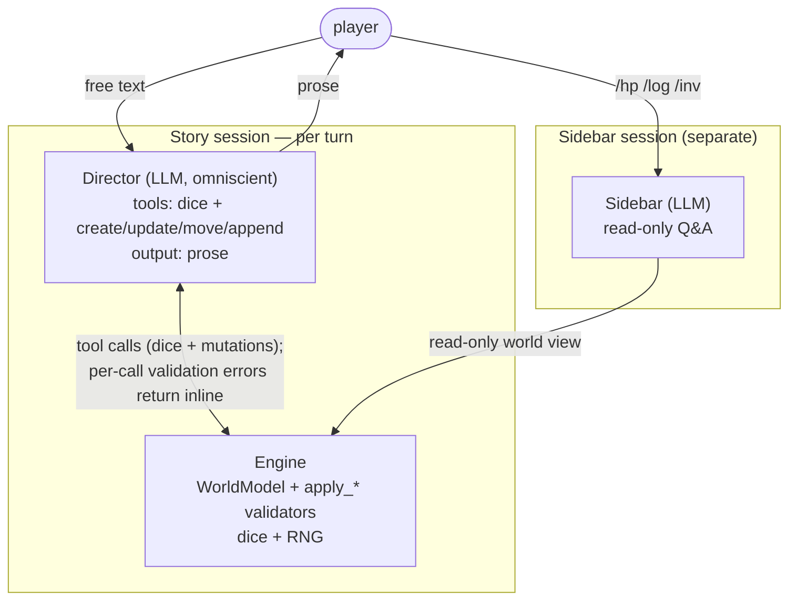

# AutoDND — LLM Dungeon Master, MVP Plan

## Context

Build a one-shot D&D Dungeon Master that prioritizes interactive storytelling over rules fidelity.

- **LLM as yes-man.** Bare LLMs follow the player's framing — no real twists, foreshadowing, or pushback.
- **Context flooding.** Mechanical queries (HP, dice math) in the same conversation as narrative pollute it.

The architectural goal: a deterministic program wrapped around a creative oracle, with **structural** defenses against drift.

## Architecture

One narrative LLM (Director) per turn. The Director reads the world, calls tools to mutate canon and roll dice, then emits prose. The Sidebar is a separate read-only session for slash-command queries.



1. **Engine** — single source of truth. Owns `WorldModel`, `render_omniscient(world)`, per-mutation `apply_*` functions (each returns `ValidationError | None`), dice/checks/combat as deterministic Python.
2. **Director** — LLM, omniscient view. Per turn: receives `render_omniscient(world)` + raw player input + **the prior turn's prose** (so it can canonize, override, or contradict improvised details). Calls dice tools to lock outcomes. Calls mutation tools to update canon. Emits prose as final output. **One agent**; bootstrap (`world.turn = -1`) and per-turn play differ only in the user message.
3. **Sidebar** — separate session for `/hp`, `/log`, `/inv`. Read-only over visible state. Never feeds into Director context.

## World Model

Three layers. Layer 1 is atomic facts. Layer 2 organizes them. Layer 3 is the player's perspective.

### Layer 1 — atoms

- **Location**: id, name, description (NL, full truth).
- **Item**: id, name, description (NL — covers equipment, lore items, *and* skills), effects (`dict[str, int]`, mechanical bonuses).
- **Event**: id (Director-supplied), monotonic `t` (engine-assigned), narrative_time (NL), location_id, participants (character ids), description (NL — full truth), thread_id.

### Layer 2 — organization

- **Character** (NPC only): id, name, description (NL, full truth — omniscient), location_id, stats (HP/AC/modifiers). Player is not a Character.
- **Thread**: id, name, parent_id (Optional — threads form a forest), description (NL, mutable arc/synopsis).

### Layer 3 — perspective

- **PlayerState**: location_id, stats, items, **log** (`list[str]`, append-only NL log of what the player perceived — observations, partial truths, misinterpretations, tells, assumptions; chronology supersedes).

### Schemas

```python
class Item(BaseModel):
    id: str; name: str
    description: str
    effects: dict[str, int] = {}

class Location(BaseModel):
    id: str; name: str
    description: str

class Event(BaseModel):
    id: str
    t: int                      # engine-assigned, monotonic
    narrative_time: str         # NL — "year 1043, spring"
    location_id: str
    participants: list[str]     # character ids
    description: str            # NL — full truth
    thread_id: str

class CharacterStats(BaseModel):
    hp: int
    ac: int
    mods: dict[str, int] = {}

class Character(BaseModel):     # NPC
    id: str; name: str
    description: str
    location_id: str
    stats: CharacterStats

class Thread(BaseModel):
    id: str; name: str
    parent_id: Optional[str]
    description: str            # mutable

class PlayerState(BaseModel):
    location_id: str
    stats: CharacterStats
    items: list[str]
    log: list[str]              # append-only

class WorldModel(BaseModel):
    locations:    dict[str, Location]
    items:        dict[str, Item]
    characters:   dict[str, Character]
    events:       dict[str, Event]
    threads:      dict[str, Thread]
    player:       PlayerState
    turn:         int           # -1 during bootstrap, 0+ during play
    next_event_t: int = 0       # engine-managed monotonic counter
```

### Why this shape

1. **Events are atoms.** Anything dramatically interesting is an event. Each entity has one `description` (the truth, omniscient).
2. **Player log is plain text.** No `event_id` linkage, no separate "false knowledge" type. Tells, misinterpretations, and pure assumptions are all just NL log lines. Supersession is chronology — the latest line wins for present-tense rendering. Director writes log entries when the player perceives something; if a perception turns out wrong, a later entry corrects it.
3. **Append-only canon at the entity level.** `Location.description`, `Character.description`, and any individual `Event` are write-once. `Thread.description` and `Item.description` are mutable to capture *current state*. Per-field policy:

   | Field                                          | Policy                  |
   |------------------------------------------------|-------------------------|
   | `Location.*`                                   | immutable after create  |
   | `Item.id`, `.name`, `.effects`                 | immutable after create  |
   | `Item.description`                             | mutable                 |
   | `Character.id`, `.name`, `.description`        | immutable after create  |
   | `Character.location_id`, `.stats`              | mutable                 |
   | `Event.*`                                      | immutable after create  |
   | `Thread.id`, `.name`, `.parent_id`             | immutable after create  |
   | `Thread.description`                           | mutable                 |
   | `PlayerState.location_id`, `.stats`, `.items`  | mutable                 |
   | `PlayerState.log`                              | append-only             |
   | `WorldModel.events`, `.locations`, etc.        | grow-only (no removal)  |

4. **No explicit NPC knowledge.** The Director (omniscient) infers what an NPC knows from `event.participants` (events they witnessed) plus their `description`.

### Rendering

`render_omniscient(world) -> str`: walks the thread forest top-down. Each thread shows description, events chronologically (location/participants resolved by name inline), nested children. Sidebars: characters, locations, items. Player state at the bottom (log, inventory, stats). Hand-rolled markdown.

**Items subsume skills.** A persuasion skill is an `Item` with `description: "trained ability"` and `effects: {"persuasion": 2}`.

## Flow

One LLM call per turn. The Director's tool-call loop handles dice + mutations + prose in a single agent run.

### Per turn

1. Player text in.
2. If slash-command → Sidebar; return.
3. **Director call.** User message = `render_omniscient(world)` + prior turn's prose + raw player input. Director calls tools:
   - `roll_dice` / `check` / `attack` / `save` for outcomes.
   - `create_*` to mint entities; `mint_event` to record canon; `move_*` / `update_*` for mutable state; `add_player_item` / `remove_player_item`; `append_player_log` for player perception; `mark_end_scene` to flag scene boundary.
   - Each mutation tool validates and either applies in place (returning `"ok"`) or returns a `ValidationError` string. The Director self-corrects from the inline error.
   - Director final output = prose (NL).
4. Print prose. Engine bumps `world.turn`.

The Director can emit prose with no tool calls (pure observation turn) or many calls (combat / scene change).

### Bootstrap

Same agent, run once at game start with `world.turn = -1`. The user message instructs: "Mint the initial world. Locations, characters, items, threads, backstory events (use `narrative_time` strings), initial player state, initial player-log entries. Then write the opening prose." World starts empty; the Director's tool calls populate it; final output is the opening prose.

After bootstrap, `world.turn` becomes `0`.

### Validation errors

`ValidationError` codes:
- `immutable_write` — tried to overwrite a write-once field
- `unknown_ref` — referenced an id that doesn't exist
- `duplicate_id` — entity id collides with an existing one
- `schema_invalid` — generic Pydantic validation failure

The Director sees errors as the tool's return value and retries the call with corrected args. No "whole-turn retry" loop.

## Tool surface

**Director**:
- Dice: `roll_dice(spec)`, `check(skill, dc)`, `attack(attack_mod, target_ac)`, `save(save_kind, dc)`.
- Creation: `create_location`, `create_character`, `create_item`, `create_thread`, `mint_event` (engine assigns `t`).
- Mutation: `update_thread_description`, `update_item_description`, `move_character`, `update_character_stats`, `move_player`, `update_player_stats`, `add_player_item`, `remove_player_item`.
- Player perception: `append_player_log`.
- Scene: `mark_end_scene`.

**Sidebar**: `query_stat`, `query_log`, `query_inventory` (read-only).

**Engine-internal** (not LLM-visible): the `apply_*` functions that the Director's tools wrap.

## Yes-man cure (structural)

1. **Dice are hard constraints.** Director must roll for any uncertain outcome; the resolution is locked before prose is written.
2. **Append-only canon.** `apply_create_*` and `mint_event` reject rewrites. Director cannot revise the past to flatter the player.
3. **Thread descriptions are commitments.** Authored at bootstrap, updateable as plot advances. Director must reason against them.
4. **Prose-feedback loop.** Each Director call sees the prior turn's prose. If the Director invented a detail last turn ("a hooded patron in the corner") it must canonize it (mint a Character + Event) or contradict it. No drift via improvisation.
5. **Prompt discipline for hidden info.** Without a separate Narrator, the Director both sees omniscient state and writes prose. The system prompt is explicit: prose is from the player's POV. Private events, NPC motives, foreshadowing-not-yet-perceived → never appear in prose. Tells appear as observations grounded in `append_player_log` entries.

## Context-flood cure (structural)

- Mechanical queries → Sidebar (separate session).
- Dice/combat = Director tool calls; tool args + result enter the agent's internal scratchpad, not the prose.
- No compaction in MVP. The Director gets `render_omniscient(world)` + prior prose + player input — all of what it needs and only what it needs.

## Decisions (locked for MVP)

- **Scope:** one-shot, in-memory, no persistence.
- **Combat:** lightweight 5e — HP, AC, attack rolls, saves, prone/frightened/restrained. No spells, feats, action economy, RAW initiative.
- **Skills as items, modifiers on stats.** `Item.effects` is the mechanical bonus map; `Item.description` is flavor. `resolve_check` reads `stats.mods[skill] + sum(item.effects[skill])`.
- **Pacing:** Director decides per turn; no engine-side tension counter.
- **Single narrative LLM.** No Narrator. Director writes prose directly.
- **PydanticAI** for both call sites (Director, Sidebar). Single OpenAI-compatible endpoint via `MODEL_ENDPOINT` / `MODEL_KEY` / `MODEL_NAME`.
- **Bootstrap:** same agent as turn play, run once at `world.turn = -1` with a different user message.
- **Event id ownership:** Director picks ids; engine auto-assigns `t`.
- **Mutations as tool calls.** Each mutation is a discrete tool, validated and applied per-call. No structured `WorldDelta`. Errors return inline.
- **Player log is plain text.** `PlayerState.log: list[str]`, append-only. No event_id linkage; chronology supersedes.
- **Interface:** stdin REPL, slash-commands for Sidebar.

## Files

```
autodnd/
  engine/    world.py, render.py, delta.py, resolution.py, rules.py
  llm/       director.py, sidebar.py, tracing.py
  cli/       main.py
  prompts/   director.md, sidebar.md
  tests/
```

- `engine/world.py` — Pydantic schemas + `WorldModel`.
- `engine/render.py` — `render_omniscient(world)`.
- `engine/delta.py` — per-mutation `apply_*` functions + `ValidationError`.
- `engine/resolution.py`, `engine/rules.py` — dice + checks + combat (RNG-injected).
- `llm/director.py` — Director agent: dice + mutation tools, prose output. Used for both bootstrap and per-turn.
- `llm/sidebar.py` — Sidebar agent (read-only Q&A).
- `cli/main.py` — REPL: per-turn dispatch (Director only) + slash-command routing.

## Implementation order

1. **World schemas** (`engine/world.py`) — drop `KnowledgeEntry`; add `PlayerState.log: list[str]`; add `WorldModel.next_event_t: int`.
2. **`apply_*` functions + validator** (`engine/delta.py`) — one function per mutation, each returning `ValidationError | None`. `mint_event` auto-assigns `t`.
3. **Rendering** (`engine/render.py`) — read `log`.
4. **Resolution + rules** — already in place; verify still correct.
5. **Director agent** — single agent with dice tools (existing) + mutation tools (new) + prose output. Used for bootstrap and turn.
6. **Sidebar** — adapt for `log`.
7. **REPL** — drop Narrator pipeline.
8. **End-to-end playtest.**

## Verification

The real test is end-to-end: run a 5–10 turn solo playtest and read the transcript. The bar is **natural, fun, logical**:

- Does prose flow like a story, not a status report?
- Are surprises plot-coherent, not arbitrary?
- Do hidden truths surface in plausible ways (Director-authored observations + private events)?
- Does dice resolution match what's narrated?
- Do `/hp` / `/log` / `/inv` queries stay invisible to Director (check trace logs)?
- Does the Director correctly self-correct from per-tool-call validation errors?
- Does prose stay in player POV — no leaked motives or private events?

Light unit tests for the deterministic layer (seeded dice, per-mutation validators, schema). They don't replace the playtest.

## Risks

1. **Director cost.** Per-turn omniscient call with tool calls. Probably the dominant cost. Mitigation: Sonnet-class model + tight system prompt + prompt cache on stable parts. Re-evaluate after playtest.
2. **Hidden-info leakage.** Director both sees omniscient state and writes prose. Without structural separation, prompt discipline is the only defense. Watch playtest for "the innkeeper, secretly an informant" style leakage.
3. **Yes-man drift.** Director owns all canon decisions. Defenses are dice (hard), append-only canon (structural), thread commitments (soft), and prompt framing ("fair adversarial DM").
4. **Tool-call latency.** Many mutation tool calls per turn = many roundtrips. If playtest shows this is slow, consider batching — but only if measured.
5. **Per-tool error recovery.** Director must understand and act on inline `ValidationError` strings. If it ignores errors and emits prose anyway, canon and prose diverge. Trace logs must surface this.
6. **Log bloat.** `PlayerState.log` grows append-only. For MVP fine; Director can append summary entries — never truncate the historical record mid-session.
7. **Player rigidity.** Pre-committed canon can feel railroaded. The mint-new-entity-on-the-fly tools are the escape valve when player input introduces something unanticipated.

## Future work

- Re-introduce a Narrator if playtest shows the prose drifts toward yes-man — revisit, don't pre-empt.
- Two-tier Director: a cheaper "is this a quiet turn?" classifier that short-circuits to a minimal prose response.
- Prior-prose compression: cap to last N turns or replace older entries with one-line summaries.
- Prompt caching to make per-turn cost viable for long sessions.
- Persistence + multi-session campaigns.
- Combat round semantics — defer until concrete need surfaces.
