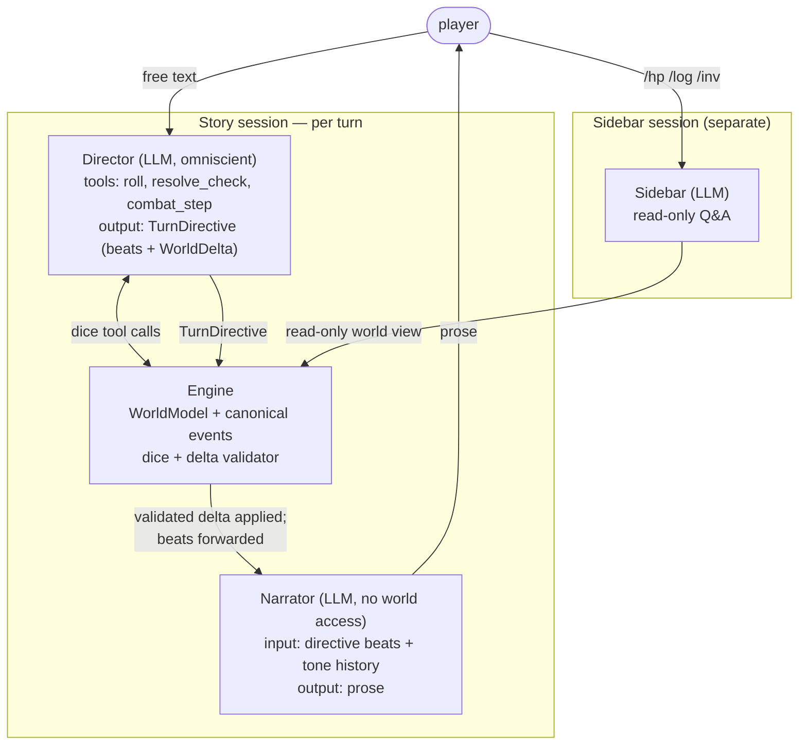

# AutoDND — LLM Dungeon Master, MVP Plan

## Context

Build a one-shot D&D Dungeon Master that prioritizes interactive storytelling over rules fidelity.

- **LLM as yes-man.** Bare LLMs follow the player's framing — no real twists, foreshadowing, or pushback.
- **Context flooding.** Mechanical queries (HP, dice math) in the same conversation as narrative pollute it.

The architectural goal: a deterministic program wrapped around a creative oracle, with **structural** defenses against drift. Repo is a stub (Python 3.14, no deps) — greenfield.

## Architecture

Two LLM roles per turn, with strict separation:

- **Director** decides *what happens*. Omniscient. Has dice tools. Authors canon.
- **Narrator** decides *how it sounds*. No omniscient view. No tools. Pure tone filter.



1. **Engine** — single source of truth. Owns `WorldModel`, `apply_world_delta` (with append-only validation), `render_omniscient(world)`, dice/checks/combat as deterministic Python.
2. **Director** — LLM, omniscient view. Per turn: receives `render_omniscient(world)` + raw player input + **the prior turn's Narrator prose** (the actual text shown to the player). The prose feedback lets the Director canonize, override, or quietly contradict any details the Narrator improvised — Narrator hallucinations get reabsorbed into canon (or rejected) on the next turn rather than drifting unchecked. May call `roll` / `resolve_check` / `combat_step` tools to lock outcomes. Outputs a `TurnDirective`: ordered `Beat`s (player-perceivable, prose-ready), a `WorldDelta` (events, knowledge, thread updates, new entities, mutable state changes), and `end_scene: bool`. The Director is the only LLM with canon authority.
3. **Narrator** — LLM, *no* world access. Per turn: receives the directive's beats + **full narration history** (every prior Narrator output this session, for tone consistency and callbacks). No tools. Outputs prose. Cannot leak hidden info because it has none. Hallucinated details are caught next turn via the Director's prose-feedback channel.
4. **Sidebar** — separate session for `/hp`, `/log`, `/inv`. Read-only over visible state. Never feeds into Director or Narrator context.

## World Model

Three layers. Layer 1 is atomic facts. Layer 2 organizes them. Layer 3 is the player's perspective on them. Storage is a normalized graph (entities indexed by id, refs cross-cut). Tree shape lives in the **rendering** layer (see below) — Pydantic doesn't have to mirror it.

### Layer 1 — atoms

- **Location**: id, name, description (NL, full truth).
- **Item**: id, name, description (NL — covers equipment, lore items, *and* skills).
- **Event**: id, monotonic fictional time `t`, location_id, participants (character ids), description (NL — full truth of what happened), thread_id (home thread). Public events get pointed at by knowledge entries; private events (motives, off-screen actions) just exist.

### Layer 2 — organization

- **Character** (NPC only): id, name, description (NL, full truth — omniscient), location_id (current), stats (HP/AC/modifiers). Player is *not* a Character.
- **Thread**: id, name, parent_id (Optional — threads form a forest), description (NL, arc/synopsis). A thread "owns" events via `event.thread_id`.

### Layer 3 — perspective

- **KnowledgeEntry**: event_id (**Optional** — `None` for pure assumptions), text (NL — player's view; may be partial, wrong, a tell, or pure assumption), learned_at (turn-time, for chronology).
- **PlayerState**: location_id, stats, items, knowledge (`list[KnowledgeEntry]`, append-only).

### Schemas

```python
class Item(BaseModel):
    id: str; name: str
    description: str

class Location(BaseModel):
    id: str; name: str
    description: str            # NL — full truth (omniscient)

class Event(BaseModel):
    id: str
    t: int                      # monotonic int, source of ordering
    narrative_time: str         # NL — "year 1043, spring" or "today, dusk at the inn"
    location_id: str
    participants: list[str]     # character ids
    description: str            # NL — full truth of what happened
    thread_id: str              # home thread

class CharacterStats(BaseModel):
    hp: int
    ac: int
    mods: dict[str, int] = {}   # ad-hoc modifiers (e.g. saves, skill bonuses)

class Character(BaseModel):     # NPC
    id: str; name: str
    description: str            # NL — full truth (omniscient)
    location_id: str            # current
    stats: CharacterStats

class Thread(BaseModel):
    id: str; name: str
    parent_id: Optional[str]    # nested → forest
    description: str            # NL — arc / synopsis (updateable)

class KnowledgeEntry(BaseModel):
    event_id: Optional[str]     # None = pure assumption
    text: str                   # NL — player's view
    learned_at: int             # = world.turn at the moment of perception; -1 for bootstrap

class PlayerState(BaseModel):
    location_id: str
    stats: CharacterStats
    items: list[str]
    knowledge: list[KnowledgeEntry]   # append-only

class WorldModel(BaseModel):
    locations: dict[str, Location]
    items: dict[str, Item]
    characters: dict[str, Character]
    events: dict[str, Event]
    threads: dict[str, Thread]
    player: PlayerState
    turn: int                   # narrator-turn counter; -1 during bootstrap, 0+ during play
    # Note: next Event.t is derivable as max(events.values(), key=t) + 1 — no need to store separately.
```

### Why this shape

1. **Events are atoms.** Anything dramatically interesting is an event. No surface/secret duplication on entities — each entity has one `description` (the truth, omniscient). The player's picture of an entity is built up from knowledge entries that ref events involving it.
2. **False knowledge is first-class.** `KnowledgeEntry.event_id` is `Optional`. Three flavors fall out naturally:
   - *Pure assumption*: `event_id=None`, NL text. ("I assume the kingdom is at peace.")
   - *Misinterpretation*: `event_id` set, NL text disagrees with the canonical event description. ("Hadrian seemed embarrassed by the gold" — actual event: he was sizing up the pouch.)
   - *Tell*: `event_id` points to a private event with no other knowledge entries; NL text is oblique. ("Something felt off about the way he turned away" — points to "Hadrian decided to betray.")
3. **Supersession is just chronology.** If the player learns the truth, append a newer entry; the older false belief stays in the timeline. Latest-on-subject wins for present-tense rendering.
4. **Append-only canon at the entity level.** `Location.description`, `Character.description`, `Item.description`, and any individual `Event` are write-once. `Thread.description` can be updated (synopsis evolves); events list grows; player.knowledge grows. Full per-field policy:

   | Field                                          | Policy                  |
   |------------------------------------------------|-------------------------|
   | `Location.*`, `Item.*`                         | immutable after create  |
   | `Character.id`, `.name`, `.description`        | immutable after create  |
   | `Character.location_id`, `.stats`              | mutable                 |
   | `Event.*`                                      | immutable after create  |
   | `Thread.id`, `.name`, `.parent_id`             | immutable after create  |
   | `Thread.description`                           | mutable                 |
   | `PlayerState.location_id`, `.stats`, `.items`  | mutable                 |
   | `PlayerState.knowledge`                        | append-only             |
   | `WorldModel.events`, `.locations`, etc.        | grow-only (no removal)  |

5. **No explicit NPC knowledge.** Only the player has a `knowledge` list. The Director (omniscient) infers what an NPC knows from `event.participants` (events they witnessed) plus their `description` (which encodes their static knowledge state). Adding `Character.knowledge` is a future option if implicit reasoning gets unwieldy in playtest.

### Rendering — single tree projection

LLMs read trees better than graphs. Only one renderer is needed:

- **`render_omniscient(world) -> str`** (for Director): walk the thread forest top-down. Each thread shows its description, its events chronologically (location and participants resolved by name inline), then nested children. Sidebars: characters (with current location), locations encyclopedia, items. Player state at the bottom (knowledge timeline, inventory, stats).

The Narrator does **not** read the world — it only reads the Director's `TurnDirective`. So there's no second projection. Pydantic stays normalized; the tree shape only appears in the Director's prompt.

**Items subsume skills.** A persuasion skill is an `Item` with `description: "trained ability: +2 to social checks"`.

## Flow

Per turn, two LLM calls run sequentially: Director then Narrator. There is no separate scene-boundary cadence.

### TurnDirective

The structured object the Director emits and the Narrator consumes:

```python
class Beat(BaseModel):
    kind: Literal["action", "dialogue", "observation", "transition"]
    text: str                       # NL — player-perceivable, prose-ready raw
    speaker: Optional[str] = None   # display name (e.g. "Hadrian"), for dialogue.
                                    # Director resolves character_id → name; Narrator never looks it up.

class EntitiesToCreate(BaseModel):
    locations:  list[Location]  = []
    characters: list[Character] = []
    items:      list[Item]      = []

class WorldDelta(BaseModel):
    # Append-only / additive
    events_to_mint:      list[Event]              # public + private; ordered by t
    knowledge_to_append: list[KnowledgeEntry]     # player perceptions; tells; assumptions
    threads_to_create:   list[Thread]
    entities_to_create:  EntitiesToCreate         # on-demand minting

    # In-place mutations (typed channels for mutable fields per the policy table)
    threads_to_update:    dict[str, str]              = {}  # thread_id → new description
    character_moves:      dict[str, str]              = {}  # char_id   → new location_id
    character_stats:      dict[str, CharacterStats]   = {}  # char_id   → full replacement
    player_moves_to:      Optional[str]               = None
    player_stats:         Optional[CharacterStats]    = None
    player_items_added:   list[str]                   = []  # item ids
    player_items_removed: list[str]                   = []  # item ids

class TurnDirective(BaseModel):
    beats:       list[Beat]    # ordered; what player perceives this turn
    world_delta: WorldDelta    # canon mutations
    end_scene:   bool = False  # this turn closes the scene

class BootstrapDirective(BaseModel):
    """Emitted once at game start (world.turn = -1). Distinct from TurnDirective:
    bootstrap mints the whole world and the opening beats in one shot, with no
    prior world to mutate."""
    entities:             EntitiesToCreate
    threads:              list[Thread]
    backstory_events:     list[Event]              # narrative_time strings recommended
    initial_knowledge:    list[KnowledgeEntry]     # learned_at = -1
    initial_player_state: PlayerState
    opening_beats:        list[Beat]               # framed from player POV; Narrator restyles same as any turn

class ValidationError(BaseModel):
    """Returned by apply_world_delta / apply_bootstrap. Empty list = success.
    On failure, the agent driver formats these as JSON and prepends them to
    a single retry of the Director call (see Flow §4)."""
    code: Literal[
        "immutable_write",      # tried to overwrite a write-once field
        "unknown_ref",          # referenced an id that doesn't exist
        "duplicate_event_id",   # Event.id collides with an existing event
        "non_monotonic_t",      # Event.t not strictly greater than current max
        "schema_invalid",       # generic Pydantic validation failure
    ]
    field_path: str             # e.g. "events_to_mint[0].id" or "character_stats.hadrian"
    detail: str                 # human-readable; Director-facing
```

### Per turn (player input → prose)

1. Player text in.
2. If slash-command → Sidebar; return.
3. **Director call.** Prompt = `render_omniscient(world)` + raw player input + **prior turn's Narrator prose** (so the Director can canonize / override / contradict any improvised details). Director may call `roll` / `resolve_check` / `combat_step` tools; engine returns deterministic Resolutions. Director emits a `TurnDirective`.
4. **Engine** validates and applies `world_delta` per the per-field mutability table. The validator returns `list[ValidationError]` (see Schemas) — empty means success. On non-empty rejection (e.g., immutable-field write, unknown id reference, non-monotonic Event.t, duplicate Event.id): re-call the Director once with `"Your previous directive was rejected:"` plus the JSON-serialized errors appended to the prompt; if the second attempt is still invalid, abort the turn and surface a brief "DM error" to the player.
5. **Narrator call.** Prompt = the directive's `beats` + full narration history (every prior Narrator output this session). No tools. No world access. Narrator emits prose. *(TODO: revisit if playtest shows the full-history token cost hurting — drop in last-N or last-N + summary compression as needed.)*
6. Print prose. Engine appends Narrator output to narration history *and* sets it as the "prior prose" the next Director call will see. If `end_scene` was set, engine notes the boundary in its own bookkeeping — e.g., a `list[int]` of turn numbers where scenes ended — **not** on `WorldModel`, which carries no scene-boundary field. Used for grouping events and as a hint for the next Director call.

The Director can request a no-op turn (empty `beats`) only if the player input is incoherent or already addressed; otherwise it must produce at least one beat.

### Bootstrap

One Director call at game start with `world.turn = -1`. Distinct path from per-turn play: emits a `BootstrapDirective` (separate type, see Schemas), not a `TurnDirective`. Director authors:

- A wide canvas: locations (current and referenced), NPCs (present and offstage), items (incl. skill items), threads (forest of plot arcs — root threads for setting-level tensions, child threads for the immediate situation).
- **Backstory events** with `narrative_time` strings like `"year 1043, spring"` covering the world's relevant history. These are normal `Event` records — same schema, same canon — they just predate the current moment.
- **Initial player knowledge**: `KnowledgeEntry`s pointing at the backstory events the player remembers. Defines who the PC is and why they're here. `learned_at = -1`.
- **Initial `PlayerState`**: location, stats, items.
- **Opening beats**: framed from the player's POV — what they perceive as the curtain rises. The Narrator restyles these into prose with exactly the same contract as any other turn (no special opening path, no peek at world state).

After apply, `world.turn` becomes `0`. The first Narrator call is just the normal turn-end Narrator call seeded by `opening_beats`.

## Worked example

See [example.md](./example.md) — three-turn trace through a Crow's Foot Inn scene, full TurnDirective JSON for each turn, demonstrating private events, append-only canon, and Director-authored tells.

## Yes-man cure (structural)

1. **Decide-then-render split.** The Director decides what happens (with omniscient view + dice constraints). The Narrator only restyles structured beats. The Narrator literally cannot drift into yes-man territory because it has no authority over outcomes.
2. **Dice are hard constraints.** Director uses `roll`/`resolve_check`/`combat_step` tools; results lock the directive's content before it's emitted. The Director cannot author a success it didn't roll.
3. **Append-only canon.** The delta validator rejects rewrites of any existing `Event`, `Location`, `Character`, or `Item`. Director cannot revise the past to flatter the player.
4. **Thread descriptions are commitments.** Authored at bootstrap (and updateable as plot advances). The Director must reason against them, not around them.
5. **Narrator has no world access.** The Narrator's prompt contains only the directive's beats and prior prose history. It cannot contradict canon, leak hidden info, or accidentally correct a player misbelief — it has no source for any of those. Hallucinated additions (a fireplace, a passing patron) are caught next turn: the Director's prompt includes the prior prose and must canonize, override, or write the invention out.

## Context-flood cure (structural)

- Mechanical queries → Sidebar (separate session).
- Dice/combat = Director tool calls; only the outcome enters the directive (and thus the Narrator's view), not the math.
- No compaction in MVP. Feed the model only what it needs and *all* of what it needs:
  - Director: full `render_omniscient(world)` + raw player input + prior turn's Narrator prose.
  - Narrator: directive beats + full prior narration history (capped/summarized only if playtest shows a problem).

## Tool surface

**Director**: `roll(spec, modifier=0)`, `resolve_check(skill, dc)`, `combat_step(action)`. Tool results inform the directive the Director emits; they don't enter Narrator context separately.

**Narrator**: none. Pure restyling.

**Sidebar**: `query_stat`, `query_log`, `query_inventory`.

**Engine-internal** (not LLM-visible): `apply_world_delta(delta)` (with append-only validation), `record_resolution(...)`.

## Decisions (locked for MVP)

- **Scope:** one-shot, in-memory, no persistence.
- **Combat:** lightweight 5e — HP, AC, attack rolls, saves, prone/frightened/restrained. No spells, feats, action economy, or RAW initiative.
- **Skills as items, modifiers on stats.** `Item` description carries flavor only. The mechanical bonus lives in `stats.mods` (e.g. `mods["persuasion"] = 2`); `resolve_check` reads from there.
- **Pacing:** Director decides per turn; no engine-side tension counter, no separate scene-boundary cadence.
- **LLM access:** **PydanticAI**. Provider-agnostic by design, native structured output, clean tool-use. All three call sites (Director / Narrator / Sidebar) go through it.
- **Model:** single OpenAI-compatible endpoint for all three agents, configured via `MODEL_ENDPOINT` / `MODEL_KEY` / `MODEL_NAME` in `.env`. Per-agent model split is a future option.
- **Bootstrap:** distinct `BootstrapDirective` (own schema) emitted by one Director call at `world.turn = -1`. Includes `opening_beats` so the first Narrator call uses the same contract as every turn.
- **Event id / `t` ownership:** Director emits both; engine validates uniqueness and monotonicity. Lets directives self-reference freshly minted events (`knowledge_to_append.event_id` → same-delta event).
- **`entities_to_create` shape:** dict-of-lists (`EntitiesToCreate` sub-model with `locations`, `characters`, `items`).
- **Mutable state in WorldDelta:** typed channels per mutable field (`character_moves`, `character_stats`, `player_moves_to`, `player_stats`, `player_items_added`/`removed`, `threads_to_update`).
- **Validator failure:** one Director retry with the validation error appended; second failure aborts the turn.
- **Narrator anti-hallucination:** prior turn's Narrator prose feeds into the next Director call. Director canonizes, overrides, or contradicts.
- **Speaker resolution:** `Beat.speaker` is a display name string, not a character id. Director resolves at emission.
- **Interface:** stdin REPL, slash-commands for Sidebar.

## Files to create

```
autodnd/
  engine/    world.py, render.py, delta.py, resolution.py, rules.py
  llm/       director.py, narrator.py, sidebar.py    # all use PydanticAI
  cli/       main.py
  prompts/   director.md, narrator.md, sidebar.md, ruleset.md
  tests/
```

- `engine/world.py` — Pydantic schemas (Layers 1–3) + `WorldModel`.
- `engine/render.py` — `render_omniscient(world)`.
- `engine/delta.py` — `Beat`, `EntitiesToCreate`, `WorldDelta`, `TurnDirective`, `BootstrapDirective`, `ValidationError` schemas + `apply_world_delta(world, delta) -> list[ValidationError]` and `apply_bootstrap(world, directive) -> list[ValidationError]` with the per-field mutability policy enforced.
- `engine/resolution.py`, `engine/rules.py` — dice + checks + combat (RNG-injected).
- `llm/director.py` — Director agent (omniscient prompt, dice tools, emits `TurnDirective`).
- `llm/narrator.py` — Narrator agent (beats + tone history → prose; no tools).
- `llm/sidebar.py` — Sidebar agent (read-only Q&A).
- `cli/main.py` — REPL: per-turn dispatch (Director → engine → Narrator) + slash-command routing.

Replace stub `main.py` with a shim importing `cli.main:main`. Add `pydantic-ai` and `pydantic` to `pyproject.toml` (already done in the scaffold).

## Implementation order

1. **World Model schemas** (Layers 1–3) + `WorldModel`. `Event.id` and `Event.t` are emitted by the Director; engine validates uniqueness of ids and monotonicity of `t` against existing events.
2. **TurnDirective + BootstrapDirective + WorldDelta + validator**: `apply_world_delta(world, delta)` enforces the per-field mutability policy (immutable fields rejected on rewrite; mutable fields applied; references resolved against current world). `apply_bootstrap(world, directive)` initializes the world from a `BootstrapDirective`. Validator returns structured errors so the Director can be re-prompted on rejection.
3. **Rendering**: `render_omniscient(world)` — hand-rolled markdown.
4. **Resolution + rules subset** (deterministic, RNG-injected).
5. **Hardcoded mini-bootstrap**: the worked-example world (1 location, 1 NPC, 1 thread, 1 seed event, 1 knowledge entry, 1 combat encounter offstage).
6. **PydanticAI agents**: Director, Narrator, Sidebar — each with a fake (scripted) implementation for tests. Director's tool-use loop must work end-to-end.
7. **REPL** wires per-turn dispatch: Director → validate/apply delta → Narrator → print prose.
8. **End-to-end playtest**.

## Verification

The real test is end-to-end: run a 5–10 turn solo playtest and read the transcript. The bar is **natural, fun, logical**:

- Does prose flow like a story, not a status report?
- Are surprises plot-coherent, not arbitrary?
- Do hidden truths surface in plausible ways (Director-authored observations + private events)?
- Does dice resolution match what's narrated?
- Do `/hp` `/log` queries stay invisible to Director and Narrator (check prompt logs)?
- Are the Narrator's renders faithful to the directive's beats — no invention, no contradiction?

Light unit tests for the deterministic layer (seeded dice, schema-validated world deltas, append-only enforcement). They don't replace the playtest.

## Risks

1. **Director cost.** Per-turn omniscient call with structured output. Probably the dominant cost. Mitigation: Sonnet-class model + tight system prompt + prompt cache on the stable parts (ruleset + scene-invariant world). Re-evaluate after playtest.
2. **Director yes-man.** The Director now owns all canon decisions. Defenses are dice (hard), append-only canon (structural), thread commitments (soft), and prompt framing ("fair adversarial DM"). The last is the weakest — needs careful authoring and red-team probes ("I'm clearly the strongest hero here") during playtest.
3. **Beat granularity.** Too few beats per turn → Narrator over-extrapolates and may drift. Too many → prose gets choppy. Director prompt needs explicit guidance: "one beat per discrete perceivable moment; speaker on dialogue; observation kind for environmental tells."
4. **Rendering quality.** `render_omniscient` is the Director's interface. Cluttered output degrades plot reasoning silently. Iterate during playtest by inspecting prompt logs.
5. **Schema enforcement.** `WorldDelta` validator must reject rewrites of any existing `Event`, `Location`, `Character`, or `Item`. Without this, drift creeps back in via revisionist deltas.
6. **Knowledge bloat.** `player.knowledge` grows append-only for the session. For MVP fine; if unwieldy, Director can append summary entries — never truncate the historical record mid-session, since false beliefs and supersession both depend on chronology.
7. **Player rigidity.** Pre-committed canon can feel railroaded. The mint-new-entity-on-the-fly path (any turn) is the escape valve when player input introduces something unanticipated; exercise it during playtest.

## Future work

- Two-tier Director: a cheaper "is this a quiet turn?" classifier that short-circuits to a minimal directive when the player input has no plot implications, saving the full omniscient-prompt call for substantive turns.
- Narration-history compression: cap to last N turns or replace older entries with one-line summaries once full-history token cost becomes a problem.
- Prompt caching to make per-turn cost viable for long sessions.
- Persistence + multi-session campaigns.
- Combat round semantics (round-per-turn vs full-fight-per-turn) — defer until step 4 of implementation order surfaces a concrete need.
